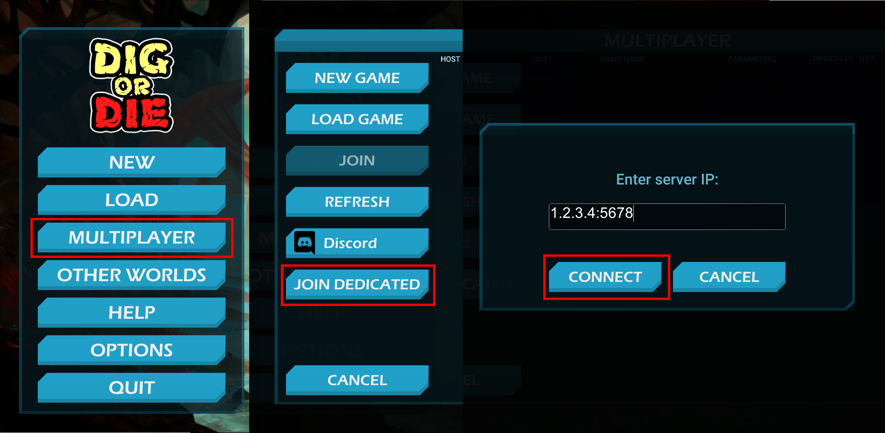

# Dedicated Client

Adds ability to connect to dedicated server.

> [!WARNING]
> This plugin removes ability to join to a game via Steam (and search lobbies too).
> You need to disable this plugin to reenable this ability (either via configuration or deleting/renaming plugin).
> 
> Since this plugin majorly reworks network functionality, it is very impractical to keep support for Steam P2P.

To join a server, go to "Multiplayer" tab in main menu and left-click on "JOIN DEDICATED" button.
Then, you need to type server IP and port (e.g., `1.2.3.4:5678`) and click "CONNECT" button.
If the connection failed, the error message will be displayed.

# Configuration

### `[General]` `Enabled`

**Setting type:** `bool` \
**Default value:** `true`

Enables the plugin.

### `[Debug]` `LogSendPackets`

**Setting type:** `bool` \
**Default value:** `false`

Logs the packets that are sended to the server (their length in bytes and first 10 bytes of their content).

> [!IMPORTANT]
> There may be some performance issue when this config is enabled.

### `[Debug]` `LogReceivedPackets`

**Setting type:** `bool` \
**Default value:** `false`

Logs the packets that are received from the server (their length in bytes and first 10 bytes of their content).

> [!IMPORTANT]
> There may be some performance issue when this config is enabled.
