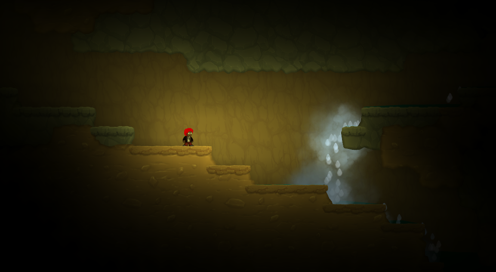

# Focused Flashlight

Changes flashlight behavior from omnidirectional (creates light in circle) to directional (creates light in a line where player is looking).

Works on all flashlight items (even that are added by other mods) and the light ray strength is depended on flashlight tier.

# Configuration

### `[General]` `Enable`

**Setting type:** `bool` \
**Default value:** `true`

Enables the plugin.

### `[General]` `LightDistanceMultipler`

**Setting type:** `float` \
**Default value:** `2.2`

Multiplies the flashlight's `m_customValue` property and uses the value as light max distance.

| Item                | `m_customValue` |
| ------------------- | --------------- |
| Flashlight          | 4               |
| Advanced Flashlight | 7               |

### `[General]` `LightColorIntensity`

**Setting type:** `Color` \
**Default value:** `E6E65EFF` (RGB: 231, 231, 95)

Color of light created by flashlight.
