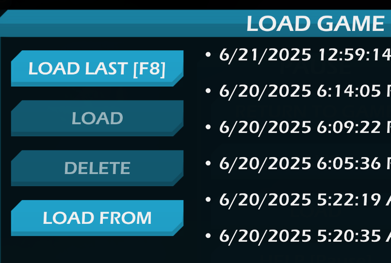
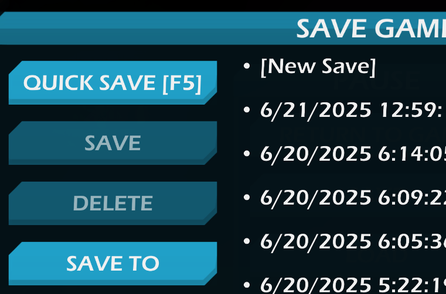

# Save Dialog

Allows to load/save game save files from/to any arbitrary path.

Before this plugin, you need to put them in specific folder (`Documents/Dig or Die/<user steam id>/<mode name>`) and then load it (or move out of that folder to share).

