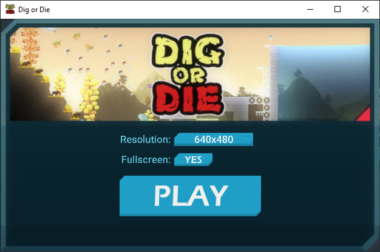

# Skip Launcher

Fully removes the startup launcher from the game and directly skips to the home screen.

You can still customize screen resolution and fullscreen mode via plugin configuration file.

# Configuration

> [!TIP]
> Recommended to install the [`BepInEx.ConfigurationManager`](https://github.com/BepInEx/BepInEx.ConfigurationManager)
> plugin to modify configuration in-game by pressing `F1` key.

| Setting            | Type   | Default                  | Description                                                                                                |
| ------------------ | ------ | ------------------------ | ---------------------------------------------------------------------------------------------------------- |
| `Enable`           | `bool` | `true`                   | Enables the plugin                                                                                         |
| `ResolutionWidth`  | `int`  | (previously saved value) | Screen width applied at startup. Invalid screen resolutions will auto-reset to current monitor resolution  |
| `ResolutionHeight` | `int`  | (previously saved value) | Screen height applied at startup. Invalid screen resolutions will auto-reset to current monitor resolution |
| `Fullscreen`       | `bool` | (previously saved value) | Fullscreen mode applied at startup                                                                         |
